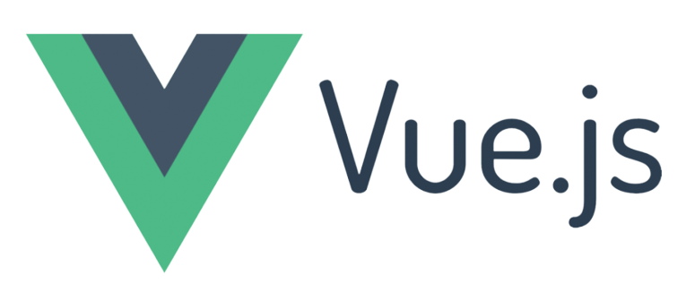
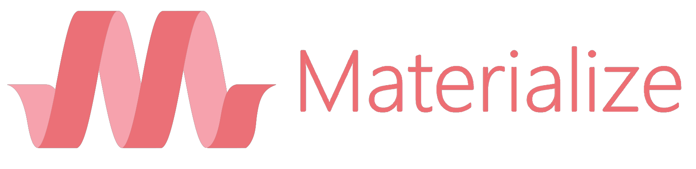

# Home Finance 


## About

Home finance is an app created for manage family accounts, but it can be used for small business too.

## APP

This repo is the frontend for Home Finance app.

It was built with:
<div>

&nbsp;

&nbsp;

&nbsp;

</div>


## Installation
After download the project, rename the file `.env.example` to `.env` and add your API host in the variables:

```
VUE_APP_ROOT_API=http://localhost:8001/api
```

Now, you will need `docker` installed. Run this command to build and up the docker container:

```
$ docker-compose up -d
```

With the container up, run the below command to serve the app:

```
$ docker exec home_finance npm run serve
```

Great, now the APP is available at `127.0.0.1:8085`

## Aditional commands


### Compiles and hot-reloads for development
```
$ docker exec home_finance npm run serve
```

### Compiles and minifies for production
```
$ docker exec home_finance npm run build
```

### Run your unit tests
```
$ docker exec home_finance npm run test:unit
```

### Run your end-to-end tests
```
$ docker exec home_finance npm run test:e2e
```

### Lints and fixes files
```
$ docker exec home_finance npm run lint
```

## I hope you enjoy it! 8)